<div align="center">  
<header>
    <h1>Small Scale Model: Pride Week</h1>
  </header>
<div align='left'>

## Project Goals + Questions
Car rideshare has gained momentum exponentially in the last few years, and now we have seen the beginning of the shared micromobility boom. How can shared micromobility companies benefit as much as their car counterparts? I wanted to explore this further.  
-  How can the scooter companies increase their profit? 
-  Should the companies invest in someone moving scooters midday to increase usage? 
-  Are there certain days of the week, times of the day, or areas of the city the scooters scooters are used most often?
-  Which transit stops have the highest usage rate? 
-  Are the scooters being used in areas with supporting infrastructure already in place such as bike lanes?   

## Table of Contents
1. [Data Munging ](#data-munging)
2. [Exploratory Data Analysis](#exploratory-data-analysis)
3. [Analysis](#analysis)
4. [Future Work](#future-work)


## Data Munging      

Each data file is in a CSV format, and upon initial look didn't need too much cleaning except to remove rows with NaN values for coordinates, trip distance and/or trip duration. The scooter and bike lane sets have coordinates that can be used for mapping purposes. The bus and rail datasets need some work to try to create new ones estimating 2019 data and to be able to compare the scooter data with ridership--waiting on new data from the CTA currently, but may do a future project creating a predictive model to obtain the data.   

#### Assumptions  
After a more thorough review of the scooter pilot data, there were some assumptions/decisions I made for my model and thus I decided to drop a few columns and filter out more of the data:  
-  Each ride is indepedent of every other ride
-  ```Census Tract``` and ```Community Area Name/Number``` were not as important feautres as the origin/destination coordinates
-  ```Start and End Location``` columns had the incorrect pairing of the coordinates
-  ```Trip Distance``` was originally in meters, each value was divided by 1609 to be shown in miles
-  ```Trip Distance``` of more than 25 miles was removed from the dataset as the timing didn't match up and a trip of more than 25 miles on a scooter is very unlikely so seems to be incorrect data  
-  ```Trip Duration``` was originally in seconds, each value was divided by 60 to be shown in minutes
-  Similarly, ```Trip Duration``` of less than 2 minutes or more than 8 hours was removed as less than 2 minutes is most likely a broken/uncharged scooter and more than 8 hours is someone keeping a scooter unlocked for instance from riding to work and then riding back at the end of the day (won't help in the question of should they be moved during the day)  

I still had over 590,000 data points after cleaning the data and filtering out bad data, so I decided to focus in on just one week of data: **Pride Week in June 2019 which was 6/21/2019 - 6/30/2019**.  

|   | Trip_ID                              | Start_Time          | End_Time            | Trip_Distance      | Trip_Duration      | Accuracy | Start_Centroid_Latitude | Start_Centroid_Longitude | End_Centroid_Latitude | End_Centroid_Longitude | Day_of_Week | Time_of_Day |
|---|--------------------------------------|---------------------|---------------------|--------------------|--------------------|----------|-------------------------|--------------------------|-----------------------|------------------------|-------------|-------------|
| 0 | 11d42b99-e839-346c-11d4-2b99e839346c | 2019-06-24 19:00:00 | 2019-06-24 19:00:00 | 0.5699192044748290 | 5.983333333333330  | 10       | 41.8941012961134        | -87.7631118242259        | 41.8941012961134      | -87.7631118242259      | 0           | 19          |
| 1 | c46c5b1f-d7a1-5c11-96b6-bb8bfa2d4fa3 | 2019-06-21 18:00:00 | 2019-06-21 19:00:00 | 0.4698570540708520 | 46.833333333333300 | 0        | 41.95358181896          | -87.72345248206660       | 41.95358181896        | -87.72345248206660     | 4           | 18          |
| 2 | 3ad30b66-b615-404b-ada2-92cfb30dd32b | 2019-06-21 21:00:00 | 2019-06-21 21:00:00 | 0.8247358607830950 | 4.0                | 152      | 41.95358181896          | -87.72345248206660       | 41.95358181896        | -87.72345248206660     | 4           | 21          |
| 3 | 8574e87e-d881-4468-bf79-f7e62f268f4d | 2019-06-21 18:00:00 | 2019-06-21 19:00:00 | 1.6948415164698600 | 22.416666666666700 | 10       | 41.95358181896          | -87.72345248206660       | 41.95358181896        | -87.72345248206660     | 4           | 18          |
| 4 | 9b79b345-1492-40f4-85a6-fee83c5a6ffc | 2019-06-26 18:00:00 | 2019-06-26 18:00:00 | 0.9919204474829090 | 5.316666666666670  | 152      | 41.95358181896          | -87.72345248206660       | 41.95358181896        | -87.72345248206660     | 2           | 18          |

<font size ="-1">*Figure 1: Five rows from cleaned scooter data June Pride Week 2019*</font><br>

## Exploratory Data Analysis

After cleaning the data, I started exploring it by looking at the spread of trip distances and durations, the frequency of rides--day of week and hour of the day--and by oberserving the spatial relationship between ride origins and destinations.  

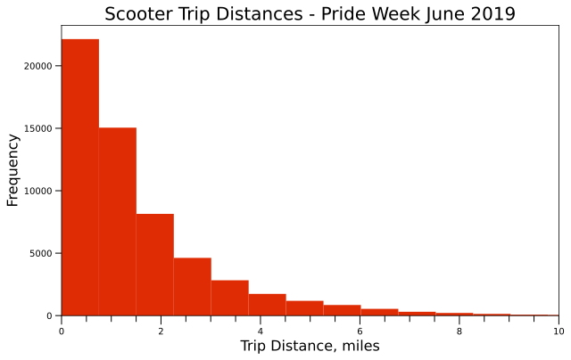   

   
> The majority of rides went less than 2 miles and were less than 15 minutes long.

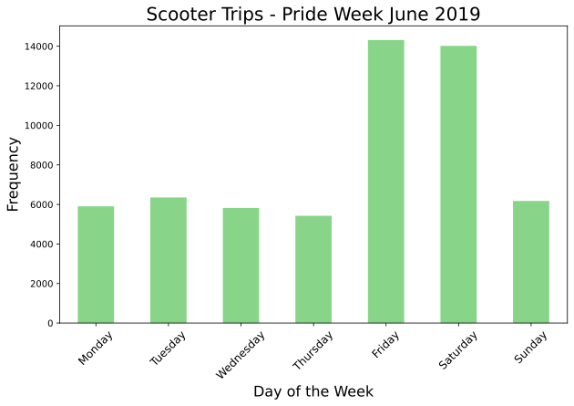  

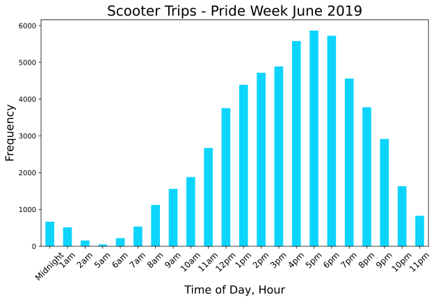
> Friday & Saturday look to be the prime days for scooter rides, and over all days in the week afternoon/evening is the prime time.

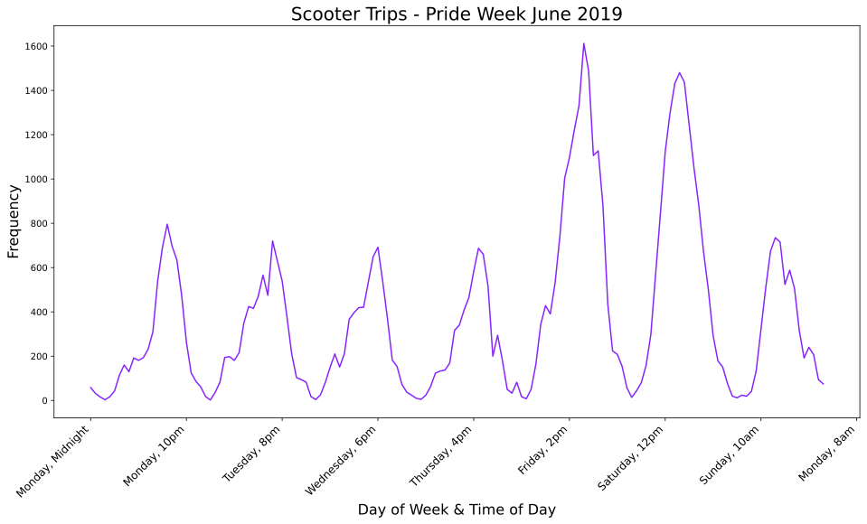   
> This shows almost a cyclic nature for rides Monday-Thursday around the end of the workday/early evening, with peak rides on Friday & Saturday around lunchtime/early afternoon, and again on Sunday a similar peak to the weekdays just shifted earlier around brunch time.

| **Scooter Ride Origins Heat Map**   |  **Scooter Ride Destinations Heat Map** |
|  ------   |   -----   |
|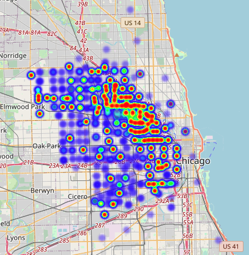  | 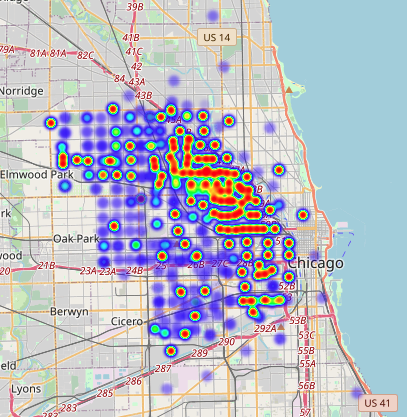 |  
> Both ride origins and destinations seem to be clustered around similar areas in the city, just that more rides start further out and end up closer to downtown as one would expect.
> We can see that certain areas further out from the downtown area have similar heat map signatures for origins and destinations so maybe the same people use scooters to get into town and then back home.


## Analysis

I chose to use unsupervised clustering analysis to extrapolate hidden relationships in the scooter ride data. Due to the nature of the data, hard clustering was used comparing both K-Means and Hierarchical clustering methods. 

#### K-Means Clustering

Initial running of the model which produced 8 cluster centers, along with the silhouette score for varying number of clusters to determine how many to use in my adjusted model are shown below.

|**Ride Origin Cluster Centers**|**Origin Silhouette Score**|**Ride Destination Cluster Centers**|**Destination Silhouette Score**|
| :----------------: | :------------------------: | :------------------------------------------: |  :-------------:  |
|  41.92271055, -87.69864685    | 2 clusters: 0.527 |  41.90502859, -87.67485789 | 2 clusters: 0.514| 
|  41.88322404, -87.65717622   |  3 clusters: 0.471|   41.93554794 -87.72108325|   3 clusters: 0.462 |
|   41.89384565, -87.76146354 |   4 clusters: 0.532 |    41.8912974, -87.71854302|   4 clusters: 0.501 |
|   41.8626154,  -87.71611382  |  5 clusters: 0.543  |   41.92274303, -87.69833183|   5 clusters: 0.518   |
|  41.93383835, -87.7709733  | 6 clusters: 0.517 |   41.93433698, -87.77101021  |    6 clusters: 0.519 |
|  41.90517536, -87.67633932 |  7 clusters: 0.529   |  41.87932401, -87.65787626  |     7 clusters: 0.508 |
|  41.92835925, -87.72146241|  8 clusters: 0.525  |   41.8485868, -87.71491064 |    8 clusters: 0.436  |
|  41.85610043, -87.66720712] |  9 clusters: 0.563  | 41.8936009, -87.76217343 |   9 clusters: 0.527 |   
<br>   

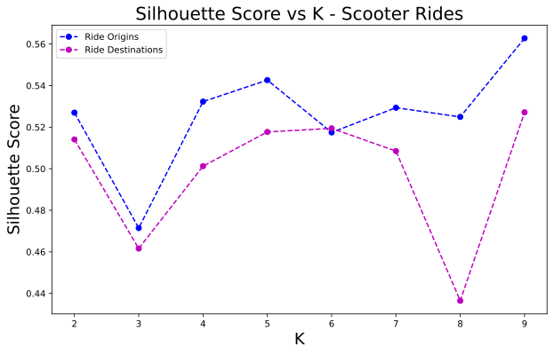   


> Based on the silhouette score plot, the largest scores--meaning tighter, non-overlapping clusters--for ride origins and destinations are 4,5,8 and 5,6 respectively.   

I ran my model again using 8 clusters for origins and 5 clusters for destinations to obtain the cluster centers. The centers are plotted below on a scatter plot of the rides along with overlaying the original ride origin or destination heat maps.  

| **Ride Origins + Cluster Centers Scatter Plot**   |  **Ride Origins Heat Map + Cluster Centers Markers** |
|  ------   |   -----   |
|  | 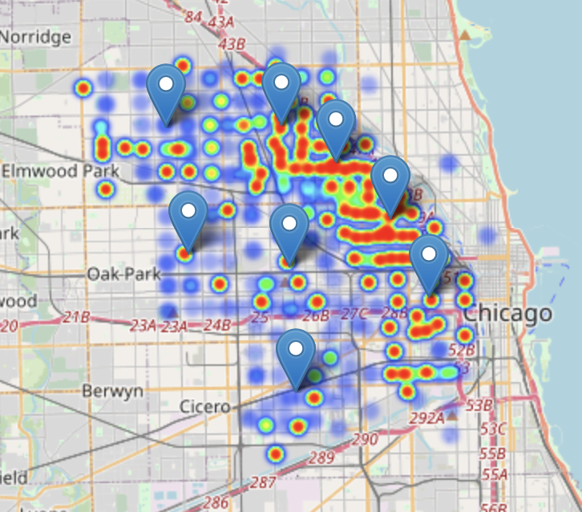 |   

| **Ride Destinations + Cluster Centers Scatter Plot**   |  **Ride Destinations Heat Map + Cluster Centers Markers** |
|  ------   |   -----   |
|  | 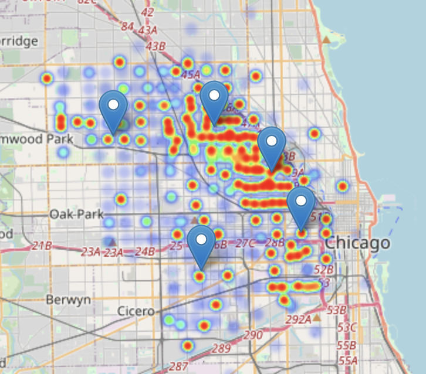 |   

#### Hierarchical Clustering

I initially ran the model with the distance metric as *Euclidean distance* to see how it compared to the K-Means model. I used the same number of clusters, 8 for origins and 5 for destinations, to visualize them on the below dendrograms.  

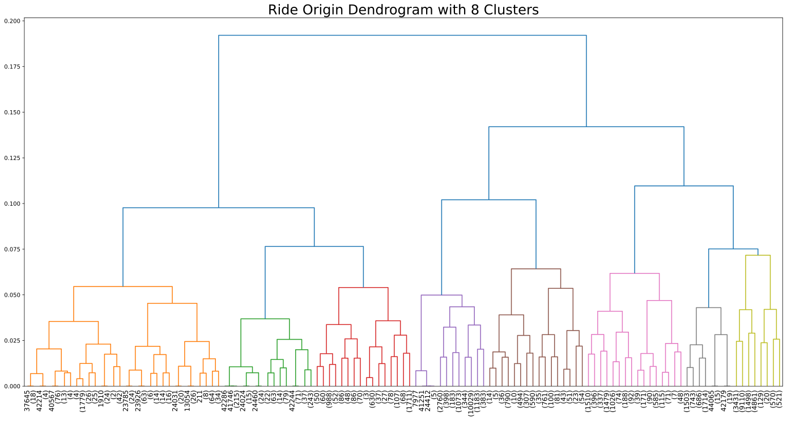  

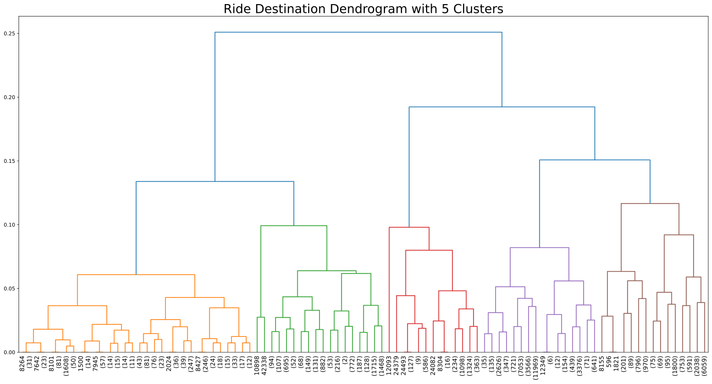   

In conclusion, based on the model outcomes and EDA I would say the morning scooter deployment seems to cover the area fairly well meaning there is no significant loss in profit. The bulk of the rides are happening within an 8-hour window, this is where the company may need to move the scooters again to make sure ride opportunities are not missed and/or they may need to charge the scooters during this window due to the amount of rides. If the company has data surrounding scooter battery life, this would be another helpful feature to determine if ridership declined due to scooters having little or no bettery life. 

## Future Work 

Future analysis:  
- Run model on full clean dataset on AWS EC2 Instance


