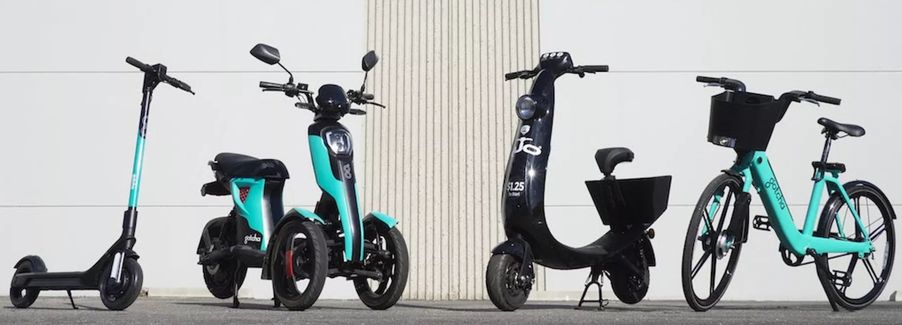
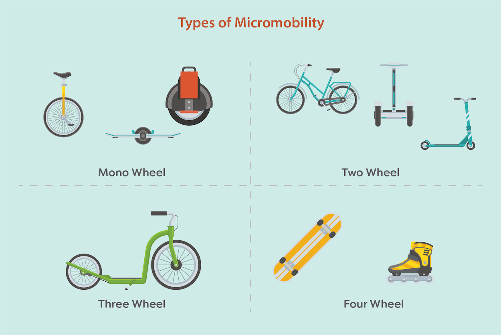
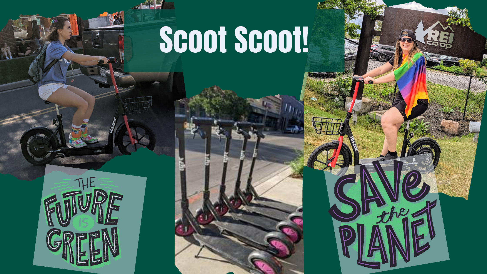
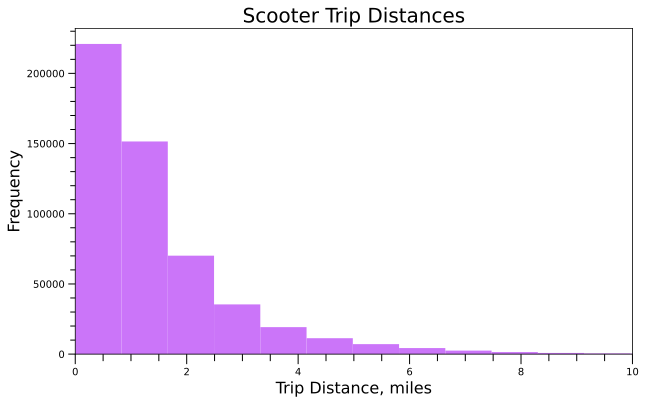
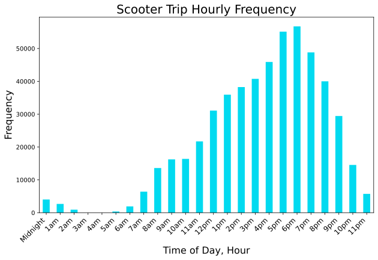
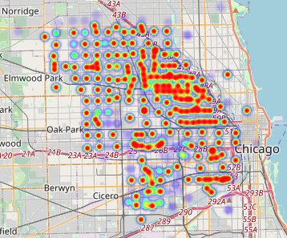
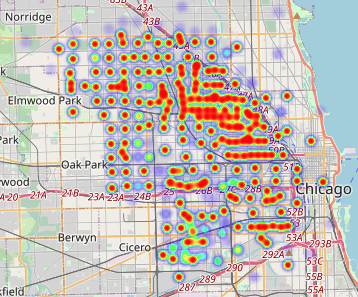
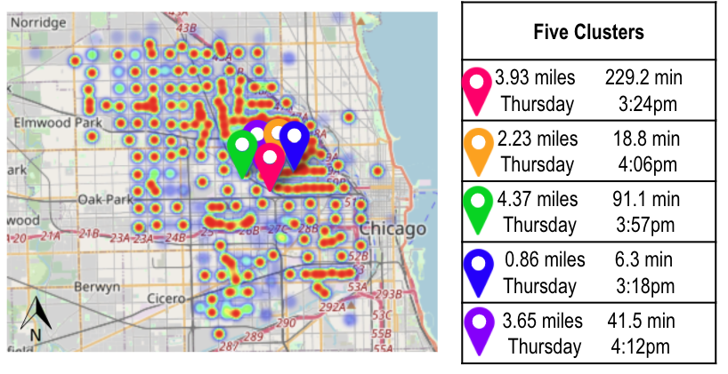
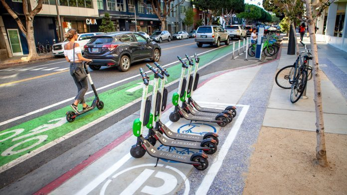

<div align="center">  
<header>
    <h1>Electric Micromobility <br>
    Scooting Towards Equitable, Carbon-Free Transportation</h1>
  </header>
<div align='left'>

   
[source](https://www.theverge.com/2019/11/19/20972322/ojo-gotcha-acquisition-electric-scooter-bike-shared-micromobility)

## Project Goals + Questions
Car rideshare has gained momentum exponentially in the last few years, and now we have seen the beginning of the shared micromobility boom. How can shared micromobility companies benefit as much as their car counterparts? I wanted to explore this further.  
-  How can the scooter companies increase their profit? 
-  Should the companies invest in someone moving scooters midday to increase usage? 
-  Are there certain days of the week, times of the day, or areas of the city the scooters scooters are used most often?
-  Which transit stops have the highest usage rate? 
-  Are the scooters being used in areas with supporting infrastructure already in place such as bike lanes?   

## Table of Contents
1. [Background and Motivation](#background-and-motivation)
2. [Raw Data and Data Munging ](#raw-data-and-data-munging)
3. [Exploratory Data Analysis](#exploratory-data-analysis)
4. [Analysis](#analysis)
5. [Future Work](#future-work)


## Background and Motivation   


<font size ="-1">*Figure 1: Micromobility Infographic (By Alison Blaine)*</font><br>  

Micromobility describes a range of small, lightweight devices operated at speeds below 26 miles per hour either owned or rented by the user. Micromobility includes bicycles, e-bikes, scooters, e-scooters, roller blades, skateboards, e-skateboards, and mono-wheels, and is an emerging transportation sector experiencing a lot of growth and evolution. <br>  

Urbanists and technologist agree, shared micromobility is one of the greatest inventions to disrupt transportation in the built environment. These battery-powered, carbon-free devices are a welcomed option for pedestrians looking for a fun, quick way to get around town. Micromobility also helps make transit more accessible and a viable option for more people by supporting first and last mile travel—a known gap within our transportation system. Due to the low cost to operate the shared variety, micromobility is being touted as a more equitable mode of transportation. <br>  

As a scooter enthusiast, I would like to understand the most profitable places for scooters to be deployed each morning in regard to transit stops, high-traffic areas, and areas with less car ownership or usage.   
 
   
<font size ="-1">*Figure 2: Scooters in Action (Pictures + Design by Samantha Buck)*</font><br> 

## Raw Data and Data Munging  

### Initial Data   

I retrieved e-scooter trip data for the 2019 pilot in Chicago, Illinois, from the City’s open [data source](https://data.cityofchicago.org/Transportation/E-Scooter-Trips-2019-Pilot/2kfw-zvte). I also obtained Chicago bicycle lane spatial [data](https://data.cityofchicago.org/Transportation/Bike-Routes/3w5d-sru8), as well as [bus](https://data.cityofchicago.org/Transportation/CTA-Ridership-Avg-Weekday-Bus-Stop-Boardings-in-Oc/mq3i-nnqe) and L [rail](https://data.cityofchicago.org/Transportation/CTA-Ridership-L-Station-Entries-Daily-Totals/5neh-572f) ridership datasets from the CTA's open source portal. The bus dataset was most recently updated in 2012, however the comprehensive rail dataset was only available for 2001. I have obtained the 2001 bus dataset as well to be able to make some assumptions, with population growth considered, for current ridership on both transit systems to be able to compare to the 2019 scooter dataset. I have reached out to the CTA to obtain more recent data and am waiting on a reply for my Freedom of Information Act request. <br>  

| Trip ID                              | Start Time             | End Time               | Trip Distance | Trip Duration | Accuracy | Start Census Tract | End Census Tract | Start Community Area Number | End Community Area Number | Start Community Area Name | End Community Area Name | Start Centroid Latitude | Start Centroid Longitude | Start Centroid Location                    | End Centroid Latitude | End Centroid Longitude | End Centroid Location                      |
|--------------------------------------|------------------------|------------------------|---------------|---------------|----------|--------------------|------------------|-----------------------------|---------------------------|---------------------------|-------------------------|-------------------------|--------------------------|--------------------------------------------|-----------------------|------------------------|--------------------------------------------|
| 758e9d21-609f-5479-8e2c-5e8f64258202 | 07/01/2019 05:00:00 PM | 07/01/2019 05:00:00 PM | 421      | 3      | 1   |      NaN        |     NaN        |   NaN      |    NaN         |    NaN        |  NaN |   NaN       |     NaN         |     NaN       |     NaN     |          NaN  |   NaN         |
| ff33490c-254a-5af2-9315-d6b2a45b07f7 | 06/29/2019 06:00:00 PM | 06/29/2019 06:00:00 PM | 6318      | 31      | 1     |    NaN      |   NaN     |    NaN       |   NaN     |  NaN    |     NaN        | NaN     | NaN  |   NaN      | NaN     | NaN      |   NaN          |
| f8a25729-e853-40f3-9200-7eea9f9c45f2 | 09/16/2019 01:00:00 PM | 09/16/2019 01:00:00 PM | 77        | 732    | 10    |     NaN          |  NaN       |    NaN            | 25            |    NaN           | AUSTIN        |     NaN           |     NaN             |   NaN       | 41.8941012961134      | -87.7631118242259      | POINT (-87.7631118242259 41.8941012961134) |
| 11d42b99-e839-346c-11d4-2b99e839346c | 06/24/2019 07:00:00 PM | 06/24/2019 07:00:00 PM | 917       | 359    | 10       |      NaN        |    NaN     | 25             | 25          | AUSTIN        | AUSTIN            | 41.8941012961134        | -87.7631118242259        | POINT (-87.7631118242259 41.8941012961134) | 41.8941012961134      | -87.7631118242259      | POINT (-87.7631118242259 41.8941012961134) |
| 0c226130-0fa6-518f-8fe6-219b9fa5f42f | 07/12/2019 07:00:00 PM | 07/12/2019 07:00:00 PM | 0       | 218      | 0     |      NaN      |    NaN       | 21        | 21      | AVONDALE          | AVONDALE           | 41.938665887698         | -87.7112106378686        | POINT (-87.7112106378686 41.938665887698)  | 41.938665887698       | -87.7112106378686      | POINT (-87.7112106378686 41.938665887698)  |

<font size ="-1">*Figure 3: Five rows from initial e-scooter pilot dataset*</font><br>

### Data Munging    

Each data file is in a CSV format, and upon initial look didn't need too much cleaning except to remove rows with NaN values for coordinates, trip distance and/or trip duration. The scooter and bike lane sets have coordinates that can be used for mapping purposes. The bus and rail datasets need some work to try to create new ones estimating 2019 data and to be able to compare the scooter data with ridership--waiting on new data from the CTA currently, but may do a future project creating a predictive model to obtain the data.   

#### Assumptions  
After a more thorough review of the scooter pilot data, there were some assumptions/decisions I made for my model and thus I decided to drop a few columns and filter out more of the data:  
-  Each ride is indepedent of every other ride
-  ```Census Tract``` and ```Community Area Name/Number``` were not as important feautres as the origin/destination coordinates
-  ```Start and End Location``` columns had the incorrect pairing of the coordinates
-  ```Trip Distance``` was originally in meters, each value was divided by 1609 to be shown in miles
-  ```Trip Distance``` of more than 25 miles was removed from the dataset as the timing didn't match up and a trip of more than 25 miles on a scooter is very unlikely so seems to be incorrect data  
-  ```Trip Duration``` was originally in seconds, each value was divided by 60 to be shown in minutes
-  Similarly, ```Trip Duration``` of less than 2 minutes or more than 8 hours was removed as less than 2 minutes is most likely a broken/uncharged scooter and more than 8 hours is someone keeping a scooter unlocked for instance from riding to work and then riding back at the end of the day (won't help in the question of should they be moved during the day)  

#### Initial Small Scale Model
I still had over 590,000 data points after cleaning the data and filtering out bad data, so I decided to focus in on just one week of data first: **Pride Week in June 2019 which was 6/21/2019 - 6/30/2019**. My initial EDA, modeling, and results for Pride Week can be seen [here](Pride_Week_Model_README.md).

|   | Trip_ID                              | Start_Time          | End_Time            | Trip_Distance      | Trip_Duration      | Accuracy | Start_Centroid_Latitude | Start_Centroid_Longitude | End_Centroid_Latitude | End_Centroid_Longitude | Day_of_Week | Time_of_Day |
|---|--------------------------------------|---------------------|---------------------|--------------------|--------------------|----------|-------------------------|--------------------------|-----------------------|------------------------|-------------|-------------|
| 0 | 11d42b99-e839-346c-11d4-2b99e839346c | 2019-06-24 19:00:00 | 2019-06-24 19:00:00 | 0.5699192044748290 | 5.983333333333330  | 10       | 41.8941012961134        | -87.7631118242259        | 41.8941012961134      | -87.7631118242259      | 0           | 19          |
| 1 | c46c5b1f-d7a1-5c11-96b6-bb8bfa2d4fa3 | 2019-06-21 18:00:00 | 2019-06-21 19:00:00 | 0.4698570540708520 | 46.833333333333300 | 0        | 41.95358181896          | -87.72345248206660       | 41.95358181896        | -87.72345248206660     | 4           | 18          |
| 2 | 3ad30b66-b615-404b-ada2-92cfb30dd32b | 2019-06-21 21:00:00 | 2019-06-21 21:00:00 | 0.8247358607830950 | 4.0                | 152      | 41.95358181896          | -87.72345248206660       | 41.95358181896        | -87.72345248206660     | 4           | 21          |
| 3 | 8574e87e-d881-4468-bf79-f7e62f268f4d | 2019-06-21 18:00:00 | 2019-06-21 19:00:00 | 1.6948415164698600 | 22.416666666666700 | 10       | 41.95358181896          | -87.72345248206660       | 41.95358181896        | -87.72345248206660     | 4           | 18          |
| 4 | 9b79b345-1492-40f4-85a6-fee83c5a6ffc | 2019-06-26 18:00:00 | 2019-06-26 18:00:00 | 0.9919204474829090 | 5.316666666666670  | 152      | 41.95358181896          | -87.72345248206660       | 41.95358181896        | -87.72345248206660     | 2           | 18          |

<font size ="-1">*Figure 4: Five rows from cleaned scooter data June Pride Week 2019*</font><br>

## Exploratory Data Analysis

After cleaning the data, I started exploring it by looking at the spread of trip distances and durations, the frequency of rides--day of week and hour of the day--and by oberserving the spatial relationship between ride origins and destinations.  

   

   
> The majority of rides went less than 2 miles and were less than 20 minutes long.

  


> Friday & Saturday look to be the prime days for scooter rides, and over all days in the week afternoon/evening is the prime time.


| **Scooter Ride Origins Heat Map**   |  **Scooter Ride Destinations Heat Map** |
|  ------   |   -----   |
|  |  |  
> Both ride origins and destinations seem to be clustered around similar areas in the city, just that more rides start further out and end up closer to downtown as one would expect.  

> We can see that certain areas further out from the downtown area have similar heat map signatures for origins and destinations so maybe the same people use scooters to get into town and then back home.  

> Due to these observations, I decided to only use ride origins as a feature in my final model.


## Analysis

I chose to use unsupervised clustering analysis to extrapolate hidden relationships in the scooter ride data. Due to the nature of the data, hard clustering was used comparing both K-Means and Hierarchical clustering methods. 

I ran my refined model on the full cleaned dataset with only six features on an AWS EC2 instance. I chose the following six features due to reasons noted in [Exploratory Data Analysis](#exploratory-data-analysis):
1. ```Trip_Distance```
2. ```Trip_Duration```
3. ```Start_Centroid_Latitude```
4. ```Start_Centroid_Longitude```
5. ```Day_of_Week```
6. ```Time_of_Day```

#### K-Means Clustering

After tuning my model on the Pride Week smaller dataset, I decided to run a K-Means clustering model with five clusters and six features (listed above). I chose to use five clusters due to the silhouette score and dendrograms from running the smaller model.  

The final five clusters had the following centroid data for origin location, trip distance, duration of trip, day of week and time of day.

   

#### Recommendations
In conclusion, based on the model outcomes and EDA I would the e-scooter companies need to focus on weekday afternoons when it comes to deploying the scooters. The morning deployment is most likely okay, so they need to focus on making sure they have enough scooters with charged batteries for the peak time between 4-6pm. 

I would also suggest to do further analysis on the dataset regarding rides under two minutes, as this may suggest dead scooters which means a loss in profit. The companies could do incentives for users to end rides in specific locations so it is easier to pick them up for charging midday and then redployment. 

I would also do futher analysis on the length of time scooters are reserved/checked out. There were multiple clusters centered at very high length of time >45 minutes even though the user only traveled three miles. This may mean that there is a limited supply of scooters in a particular area so they keep it reserved; thus, the company could increase their profit by deploying more scooters in those areas.

## Future Work 
I would love to be able to use these cleaning and analysis pipelines on other cities’ scooter pilot data so a new market can see the value of adding shared micromobility, as well as continue exploring the future steps listed below.  

Future analysis could be:  
- Rework my six features to make day of week and hour of day of the scooter trip categorical rather than numerical features, because right now that is most likely why the cluster centers are all around 3pm on Thursdays
- Suggest another pilot that is over the entire year to see if there are any seasonal dependencies for profit
- Compare scooter trip spatial data with bike lane and pedestrian infrastructure: users may be more likely to ride scooters in areas that feel safe
- Visualize most trafficked transit stops
- Compare scooter clusters against transit data
- Develop code to pull Google Street Cam footage of cluster centers 
- Create a predictive machine learning model using available scooter data to predict the best locations for drop off in the morning and afternoon—which locations have the highest profitability potential, utilization rates, connect the most people to transit, etc.  


  
<font size ="-1">*Figure 5: Micromobility infrastructure + e-scooter rider*</font><br>
[source](https://chi.streetsblog.org/2019/05/01/chicago-will-launch-a-pilot-with-2500-dockless-scooters-on-june-15/)
<br>


